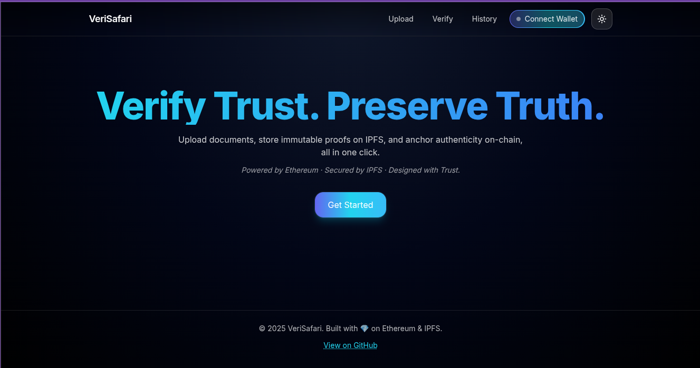
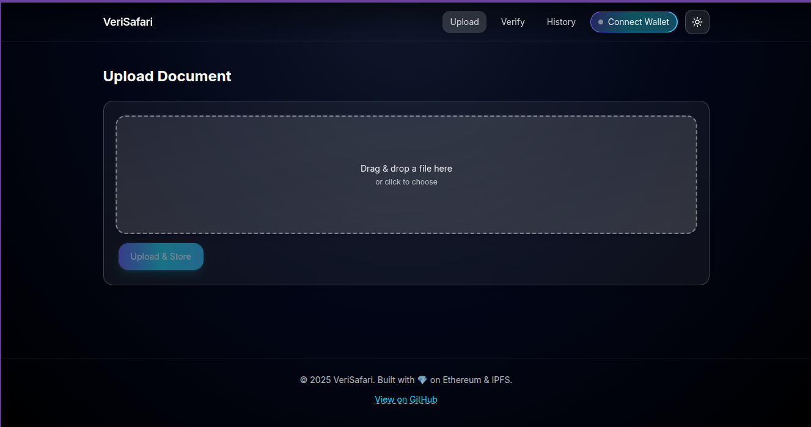

## 🦓 VeriSafari


VeriSafari is a decentralized document verification platform that leverages Ethereum (Sepolia) and IPFS to provide immutable proof of authenticity for digital files. It lets users upload, verify, and track document hashes securely on-chain, ensuring transparency, integrity, and long-term trust.

### 🌍 Overview
In an era of sophisticated forgery and tampering, VeriSafari offers a trustless verification layer that bridges blockchain transparency with IPFS permanence. Each uploaded document is hashed (SHA‑256), stored on IPFS, and its proof is anchored immutably on Ethereum.

Users can:
- Upload documents → generate and store proof on-chain
- Verify any document’s authenticity against the on-chain registry
- View a full verification history linked to their wallet

### ⚙️ Tech Stack
| Layer | Technology | Purpose |
| --- | --- | --- |
| Frontend | Next.js (Pages), Tailwind CSS, Framer Motion | Reactive, modular UI/UX (Atomic Design) |
| Smart Contracts | Solidity + Hardhat | On-chain proof storage and verification |
| Storage | IPFS via Pinata | Distributed file storage |
| Network | Ethereum Sepolia Testnet | Proof anchoring |
| Wallet | Wagmi + RainbowKit (WalletConnect) | Web3 wallet connect flow |
| Deployment | Vercel | Frontend hosting & CI/CD |
| API | Next.js API Routes | IPFS uploads, verification endpoints |

### 🚀 Features
- Decentralized verification using on-chain proofs
- IPFS storage (immutable and censorship-resistant)
- Wallet-based identity and ownership tracking
- Transparent history per wallet
- Modern UI built with Atomic Design, Tailwind, and Framer Motion
- Privacy-preserving: only hashes are stored; your files stay private

### 🧩 Architecture
```
User → Next.js Frontend → API Routes → IPFS (Pinata)
                          ↳ Hardhat Contract → Ethereum Sepolia
                          ↳ Aqua SDK → aqua.json → IPFS
```

Smart Contract (key functions):
- `storeDocument(ipfsHash, fileHash, aquaCid)` — Anchors document proof on-chain with Aqua proof CID
- `verifyDocument(fileHash)` — Returns `(valid, ipfsHash, aquaCid, timestamp)`
- `getDocumentHistory(address)` — Returns uploaded document proofs by wallet (includes `aquaCid`)

### 🧰 Prerequisites
- Node.js 18+ and npm
- A funded wallet on Sepolia testnet
- Pinata account (JWT recommended, or API key/secret)
- WalletConnect Cloud Project ID (RainbowKit)
- Sepolia RPC URL (Alchemy/Infura)
 - Aqua: Alchemy API key for witness verification

## ⚙️ Setup & Installation

### 1) Clone and install
```bash
git clone https://github.com/gethsun1/verisafari.git
cd verisafari
npm install
```

### 2) Environment variables
Create `.env` (server-only) and optionally `.env.local`:
```env
SEPOLIA_RPC_URL=https://eth-sepolia.g.alchemy.com/v2/...
PRIVATE_KEY=0x...
PINATA_JWT=...                           # preferred
# Alternatively:
# PINATA_API_KEY=...
# PINATA_API_SECRET=...

NEXT_PUBLIC_WC_PROJECT_ID=...
NEXT_PUBLIC_ALCHEMY_API_KEY=... # optional

# Aqua SDK (server-only)
ALCHEMY_API_KEY=...              # used by Aqua Ethereum witness verification
AQUA_WITNESS_NETWORK=sepolia      # sepolia | mainnet | holesky
AQUA_WITNESS_METHOD=cli           # cli | metamask | inline
# Optional: enable additional witnesses/signing
AQUA_MNEMONIC=...
AQUA_DID_KEY=...
AQUA_NOSTR_SK=...
```

### 3) Compile and deploy the contract (Sepolia)
```bash
npx hardhat compile
npx hardhat run scripts/deploy.js --network sepolia
```
This writes `src/lib/contract-config.json` with `{ address, chainId, abi }`.

### 4) Run locally
```bash
npm run dev
```
Visit `http://localhost:3000`.

### Aqua Flow
- During upload, the server creates an Aqua genesis proof (`aqua.json`) using Aqua SDK, uploads it to IPFS, and returns `aquaCid`.
- The dApp stores `ipfsHash`, `fileHash`, and `aquaCid` on-chain via `storeDocument`.
- During verification, the server validates on-chain data and verifies `aqua.json` using Aqua SDK (including Ethereum witness via Alchemy when present).

## 🖼️ Screenshots

> 

Home



Upload



## 🧠 Usage Guide

### Upload
1) Go to `/upload`  
2) Drag & drop your file → server computes SHA‑256 → uploads to IPFS  
3) Confirm the blockchain transaction to store proof (`storeDocument`)

### Verify
1) Go to `/verify`  
2) Upload a file or paste a SHA‑256 hash/CID  
3) The system checks proof against on-chain data (`verifyDocument`) and shows authenticity, timestamp, and IPFS CID

### History
1) Go to `/history`  
2) Connect wallet  
3) View your verified documents with timestamps and IPFS links (`getDocumentHistory`)

## 🔌 API Endpoints
| Method | Route | Description |
| --- | --- | --- |
| POST | `/api/upload` | Uploads file → `{ ipfsHash, fileHash, aquaCid }` |
| POST | `/api/verify` | Verifies by hash or file → `{ valid, ipfsHash, aquaCid, aqua, timestamp }` |
| GET | `/api/history?address=0x...` | Fetches document history by wallet address |

## 🖥️ Deploying to Vercel

1) Build:
```bash
npm run build
```
2) Add environment variables on Vercel:
- `NEXT_PUBLIC_WC_PROJECT_ID`
- `NEXT_PUBLIC_ALCHEMY_API_KEY`
- `SEPOLIA_RPC_URL`
- `PINATA_JWT`
3) Deploy:
```bash
vercel --prod --yes
```

## 🧯 Troubleshooting

- App builds but upload fails
  - Ensure server env vars are set on Vercel: `SEPOLIA_RPC_URL`, `PINATA_JWT` (or `PINATA_API_KEY`/`PINATA_API_SECRET`).
  - Check IPFS credentials (Pinata JWT or key/secret) and that they’re not exposed with `NEXT_PUBLIC_`.

- “Contract config missing. Deploy first.”
  - Run the deploy script and confirm `src/lib/contract-config.json` exists and contains the deployed address/ABI for Sepolia.

- Wallet connect doesn’t show
  - Ensure `NEXT_PUBLIC_WC_PROJECT_ID` is set and WalletConnect project is active.

- TypeScript error with FormData/Blob on server
  - We use `form-data` for Node in `src/lib/ipfs.ts`. Ensure dependencies are installed and you’re not trying to call it client-side.

- Wrong network
  - RainbowKit app is set to Sepolia. Switch your wallet to Sepolia or update the chain config.

## 🧱 Project Structure
```
verisafari/
├── contracts/
│   └── DocumentRegistry.sol
├── scripts/
│   └── deploy.js
├── src/
│   ├── components/
│   │   ├── atoms/
│   │   ├── molecules/
│   │   ├── organisms/
│   │   └── templates/
│   ├── lib/
│   │   ├── contract-config.json
│   │   ├── ipfs.ts
│   │   └── utils.ts
│   ├── pages/
│   │   ├── api/
│   │   │   ├── upload.ts
│   │   │   ├── verify.ts
│   │   │   └── history.ts
│   │   ├── index.tsx
│   │   ├── upload.tsx
│   │   ├── verify.tsx
│   │   └── history.tsx
│   └── styles/
│       └── globals.css
├── hardhat.config.js
├── tailwind.config.ts
├── postcss.config.js
├── package.json
└── README.md
```

## 🧬 Roadmap
- MVP with IPFS + Sepolia deployment
- WalletConnect integration (Wagmi + RainbowKit)
- UI/UX revamp with Atomic Design
- Multi‑network support (e.g., Base, Scroll)
- Optional client‑side encryption (AES before IPFS)
- Public proof verification API for third‑party apps
- ENS name integration for verified identity

## 🤝 Contributing
Pull requests and feature ideas are welcome!  
Fork, create a feature branch, and open a PR with a clear description.

Notes:
- Hash format is SHA‑256 (lowercase hex).
- IPFS upload is server-side; secrets are never exposed to the client.
- Network: Sepolia (`chainId` 11155111).

  ## 🔗 Live Demo
- Production: [`Vercel Dapp`](https://verisafari.vercel.app/)
  
    _Powered by Ethereum · Secured by IPFS · Designed with Trust._


## 🛡️ License
MIT License © 2025 Gethsun Misesi (Quantum Quasar)
